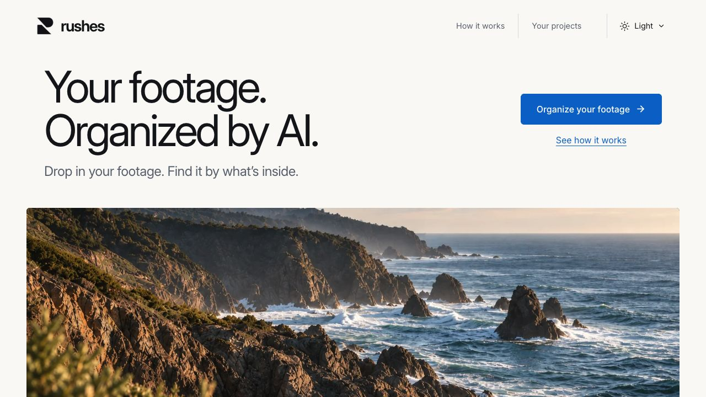
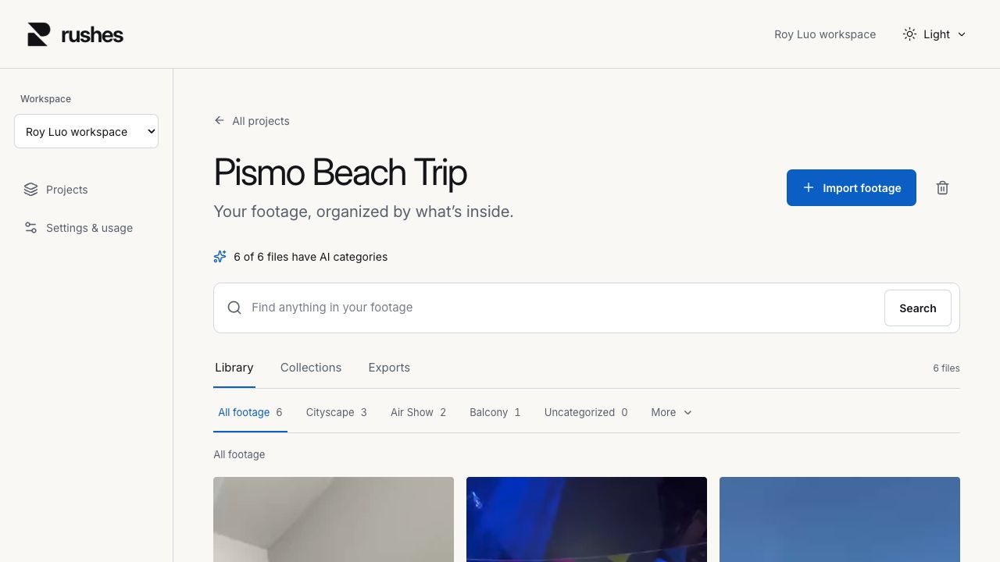
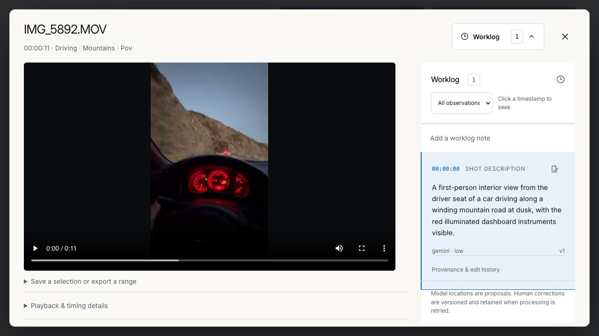

<div align="center">
  
  <h1>RUSHES</h1>
  <p><strong>Drop in footage. Let AI organize it. Find the shot you need.</strong></p>
  <p>
    <a href="https://rushes.onrender.com">Live app</a> ·
    <a href="https://screen.studio/share/9dYaSqmr">Watch the demo</a> ·
    <a href="docs/ARCHITECTURE.md">Architecture</a> ·
    <a href="#run-locally">Run locally</a>
  </p>
  <a href="https://github.com/ryouol/rushes/actions/workflows/ci.yml"></a>
</div>

RUSHES turns a folder of video into a searchable footage library. It analyzes shots, produces timestamped observations, groups footage by content, and lets you review the evidence before saving or exporting a selection. The core workflow is **ingest → analyze → organize → search → review → export**.

[](https://screen.studio/share/9dYaSqmr)

**[Watch the recorded walkthrough →](https://screen.studio/share/9dYaSqmr)**

## What you can do

- **Import a shoot:** upload files or folders, or index explicitly configured local source folders. Originals remain intact.
- **Organize automatically:** browse AI-generated categories and inspect or correct assignments.
- **Search the content:** combine keyword and embedding retrieval to find footage through timestamped evidence.
- **Review the source:** play video, jump to observations, and keep versioned human corrections alongside model provenance.
- **Collect and export:** save searches and selections, adjust ranges, render clips, or copy originals into an organized output.
- **Manage access and storage:** isolated workspaces, owner/editor/viewer roles, Google or password sign-in, and explicit deletion controls.

### Organized library



### Review with evidence



Screenshots show the running application. See [capture notes](docs/screenshots/README.md).

## Engineering overview

| Layer | Implementation |
| --- | --- |
| Interface | React 19, Next.js 16, TypeScript, Radix UI |
| Public server | FastAPI / Uvicorn serving both the API and exported frontend in production |
| Persistence | PostgreSQL, SQLAlchemy, Alembic, pgvector, workspace row-level security |
| Durable processing | Temporal workflows, persisted checkpoints, bounded activity concurrency |
| Media | FFmpeg / ffprobe, scene detection, source timestamp mappings |
| AI | Gemini visual analysis; faster-whisper transcription and FastEmbed embeddings |
| Deployment | Render web/API/workflows with persistent media storage; private Modal speech and embedding functions |

Next.js is used to build the frontend; **production does not run a separate Node server**. Local development can run speech and embeddings on the same machine. Visual analysis sends derived video and transcript context to Google; local operation is not fully offline.

### Where to start reviewing

| Concern | Start here |
| --- | --- |
| Ingestion, checkpoints, retries | [workflows.py](backend/rushes/workflows.py), [pipeline.py](backend/rushes/pipeline.py) |
| AI request validation and uncertain outcomes | [inference.py](backend/rushes/inference.py), [provider_budget.py](backend/rushes/provider_budget.py) |
| Tenant isolation and identity | [db.py](backend/rushes/db.py), [auth.py](backend/rushes/auth.py), [migrations](backend/migrations/versions) |
| Retrieval and organization | [routes_search.py](backend/rushes/routes_search.py), [organization.py](backend/rushes/organization.py) |
| Timing and export correctness | [source_frames.py](backend/rushes/source_frames.py), [media.py](backend/rushes/media.py), [exports.py](backend/rushes/exports.py) |
| UI and navigation | [rushes.tsx](web/components/rushes.tsx), [project.tsx](web/components/project.tsx), [player.tsx](web/components/player.tsx) |
| Verification | [tests](tests), [browser regressions](web/e2e), [CI](.github/workflows/ci.yml) |

The [architecture guide](docs/ARCHITECTURE.md) explains the runtime, data flow, and design tradeoffs. The [documentation index](docs/README.md) separates current guides from historical review and deployment evidence.

## Run locally

Requires **Python 3.12 or 3.13**, **uv**, **Node.js 22+**, **Docker Compose**, and **FFmpeg/ffprobe**. Leave room for model downloads, originals, previews, and exports; processing keeps a 2 GiB disk reserve by default.

```sh
git clone https://github.com/ryouol/rushes.git
cd rushes
uv sync --locked
uv run python scripts/configure.py
docker compose up -d --wait
uv run python scripts/bootstrap_db.py
uv run python scripts/setup_temporal.py
npm --prefix web ci
uv run python scripts/reindex.py
uv run python scripts/dev.py
```

Open **[localhost:3741](http://localhost:3741)** and create your account. There is no shared demo password. `configure.py` generates a private `.env` and preserves it on subsequent runs.

For visual analysis, set `RUSHES_GEMINI_API_KEY` in `.env` and restart the app. Without it, previews and transcription remain available; visual analysis is reported as incomplete. Google sign-in is optional locally and requires your own OAuth client—see [Google setup](docs/GOOGLE-AUTH.md).

For the exported production frontend:

```sh
uv run python scripts/build_web.py
uv run python scripts/dev.py --production
```

See [development and configuration](docs/DEVELOPMENT.md) for ports, tests, model settings, storage, and troubleshooting.

## Tests and verification

CI runs Python lint, backend tests, the production frontend build, TypeScript checks, and browser regressions. Ordinary CI does not make paid AI calls. See the [workflow](.github/workflows/ci.yml) for its isolated PostgreSQL setup and exact commands.

```sh
# After local database setup; explicitly disable paid provider calls.
RUSHES_GEMINI_API_KEY= RUSHES_PROVIDER_MONTHLY_ALLOWANCE_MICROUSD=0 uv run pytest -q -m "not provider"
uv run ruff check backend scripts deploy tests
uv run python scripts/build_web.py
npm --prefix web run typecheck
```

The [export-memory incident report](docs/EXPORT-MEMORY-REVIEW.md) is one example of the engineering evidence: a reproduced production failure, a measured fix, regression coverage, deployment checks, and the resulting compression tradeoff. Historical results are labeled by revision and fixture rather than presented as general throughput guarantees.

## Current scope

RUSHES is deployed and usable, with active work on reliability and evaluation. Model descriptions, localization, and search ranking still need human review. Representative long-footage capacity and retrieval quality have not been established across a labeled benchmark.

Rendered clips use H.264/AAC and the first video/audio streams; they are not an archival mastering format. FCP7 XML and FCPXML interchange are experimental and have not been verified by a round trip through a target editor. Paid subscriptions are not implemented. The hosted instance has limited storage and AI allowance.

## Contributing and security

Read [CONTRIBUTING.md](CONTRIBUTING.md) for development and review expectations. Report security issues through the private process in [SECURITY.md](SECURITY.md), not public issues. Credentials, uploaded originals, databases, and local runtime artifacts are excluded from Git.

No open-source license has been selected. Public visibility allows inspection but does not grant a general license to reuse the code or footage.
