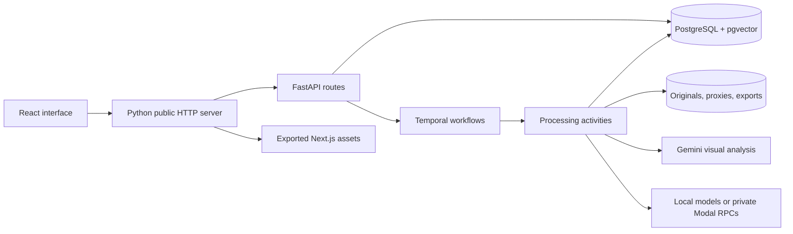

# Architecture and reviewer guide

RUSHES organizes source footage around durable processing records and timestamped evidence. This guide describes the current implementation; review reports elsewhere in this directory retain the revision they inspected.

## Runtime

The production container serves exported frontend assets and API requests from the Python server. Hosted processing workers share the API process; the supervisor also runs the Temporal service. This reduces the memory cost of a separate Node runtime and duplicate Python imports. It couples failure domains and capacity, so deployments and media processing need to be evaluated together. Local development retains separate API, worker, frontend, and Temporal processes.

Start with [http_server.py](../backend/rushes/http_server.py), [frontend.py](../backend/rushes/frontend.py), [api_lifespan.py](../backend/rushes/api_lifespan.py), and [serve.py](../scripts/serve.py). [The static frontend review](STATIC-FRONTEND-REVIEW.md) records request-boundary and lifecycle regressions.

## Data flow

1. **Import:** authenticated routes create workspace/project-scoped assets. Uploads go into managed storage; allowlisted indexing references existing originals. Source checksums and media metadata establish identity.
2. **Prepare:** durable activities probe streams, create playable proxies, map source timestamps, detect scenes, and transcribe speech. Checkpoints allow recovery without restarting every completed stage.
3. **Analyze:** bounded windows combine derived video and transcript context. Token limits, structured-output validation, provenance, and provider accounting surround generation. Categories and timestamped observations are persisted.
4. **Retrieve:** keyword and embedding candidates are bounded, combined, and returned with evidence tied to source intervals. Saved searches and collections are separate from the source assets.
5. **Review/export:** human changes retain history. A selected interval is rendered from the original source; organized copies preserve original bytes. Completed outputs have durable records and download routes.

See [models.py](../backend/rushes/models.py), [workflows.py](../backend/rushes/workflows.py), [pipeline.py](../backend/rushes/pipeline.py), and [routes_search.py](../backend/rushes/routes_search.py).

## Boundaries worth reviewing

| Boundary | Design | Relevant coverage |
| --- | --- | --- |
| Workspace access | Route membership checks plus PostgreSQL RLS; runtime role is not the schema owner and cannot bypass RLS | [test_database.py](../tests/test_database.py), [test_security.py](../tests/test_security.py) |
| Google identity | State, browser binding, nonce, PKCE, signed token verification, explicit connection of existing password accounts | [test_google_auth.py](../tests/test_google_auth.py) |
| Filesystem | Managed paths and explicit source roots; identity checks and isolated output locations | [test_storage.py](../tests/test_storage.py), [test_deletion.py](../tests/test_deletion.py) |
| Provider calls | Reserve exposure before dispatch; persist responses; retain uncertain outcomes without blindly repeating paid generation | [test_provider_budget.py](../tests/test_provider_budget.py), [test_inference.py](../tests/test_inference.py) |
| Workflow recovery | Persisted checkpoints, leases, activity cancellation and supervised lifecycle | [test_pipeline.py](../tests/test_pipeline.py), [test_worker_lifecycle.py](../tests/test_worker_lifecycle.py) |
| Media timing | Half-open elapsed-microsecond intervals, source frame PTS, explicit proxy mappings | [test_timing.py](../tests/test_timing.py), [test_media.py](../tests/test_media.py) |
| HTTP/frontend | Same-origin deployment, request deadlines, safe static paths, callback log redaction | [test_frontend.py](../tests/test_frontend.py), [test_http_protocol.py](../tests/test_http_protocol.py) |

## Tradeoffs and limits

**External effects are not exactly once.** A provider can accept a request before the application saves the response. Unknown outcomes retain their recorded exposure and are not automatically treated as a safe retry. The design favors inspectable partial results over duplicate paid dispatch.

**Time precision is not semantic accuracy.** Source PTS and interval validation make export behavior deterministic for tested media. They do not make a model's description or temporal localization correct. Human edits and provenance remain part of the product.

**Low fixed hosting cost limits concurrency.** The current hosted deployment uses one small service with durable storage. Recent export work reduced encoder buffering after a real out-of-memory incident; it does not establish arbitrary 4K/8K or multi-user capacity. See [the measured incident](EXPORT-MEMORY-REVIEW.md).

**Storage and metadata must be backed up together.** The database contains paths and workflow state, not an independent copy of all source media. A database restore alone cannot recover missing originals or exports.

**Search needs evaluation.** Bounded hybrid retrieval and a distance heuristic are implemented. A representative human-labeled query set is still needed to measure precision, recall, and failure modes by content type.

## Review order

Read the model and migration boundaries first, follow one import through workflow activities and provider dispatch, then follow one search result through source review and export. Compare the implementation with its focused tests before reading the chronological review archive. This keeps architectural intent, failure handling, and observed evidence close together.
