# RUSHES refinement audit — 11 September 2026

Scope: preserve the approved font, logo, palette, and coastal image direction; replace landing-page library/demo language with marketing content and restrained scroll motion; keep signed-in logo navigation inside the product; improve buggy loading and editing states; add Google sign-in and explicit account linking.

Captured and inspected in the Codex in-app browser. Desktop comparison uses a 1280 × 800 viewport; responsive verification uses 390 × 844. The before and after desktop images were inspected together. The hero typography, primary action, brand and spacing remain consistent; the former example header is removed, the coastal image becomes a wider cinematic composition, and a new marketing explanation introduces the three static images. Image crops and section height change intentionally.

1. **Landing page — healthy after refinement.** The initial screen described an “example” library and “static illustration · sample imagery,” which conflicted with the intended marketing page. Those labels and any library/player controls are absent from the new surface. The three images are static figures labeled Scenes, Details, and Perspectives. Pause/Resume controls only the subtle image transforms. Text, links, and workflow instructions remain stationary.

   Before: 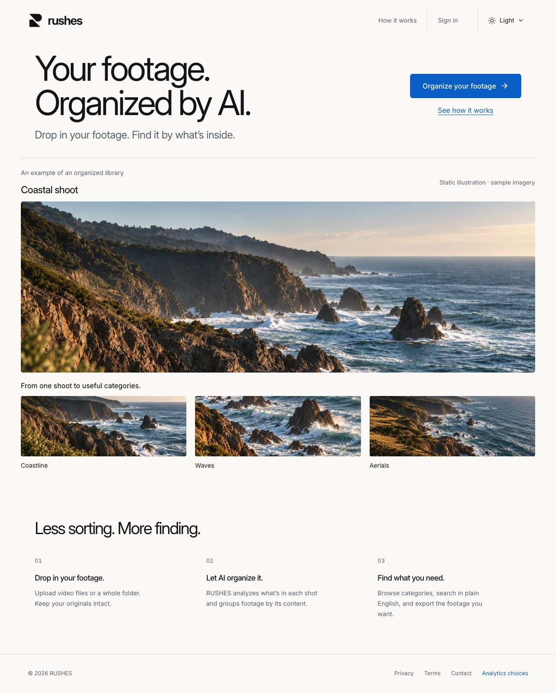

   After: 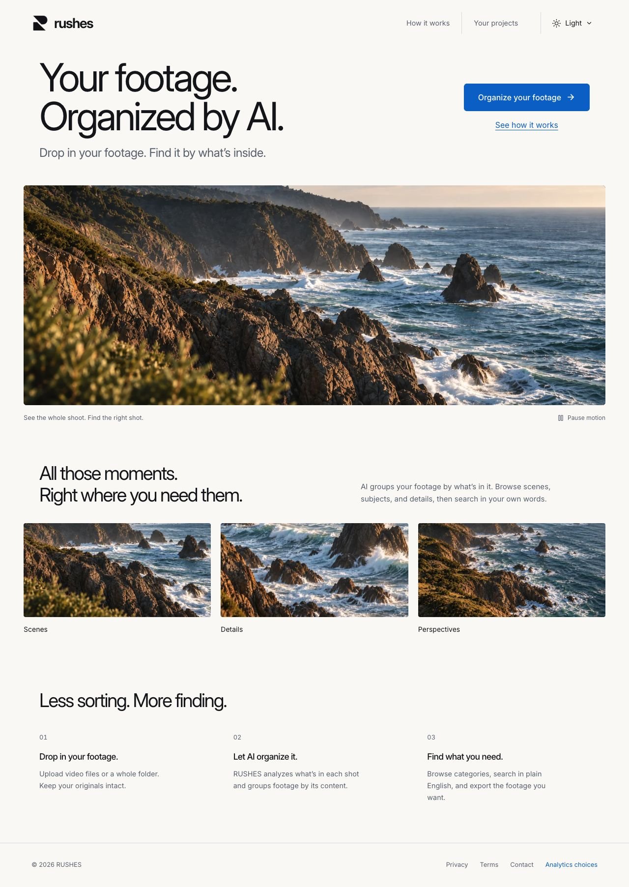

   Dark: 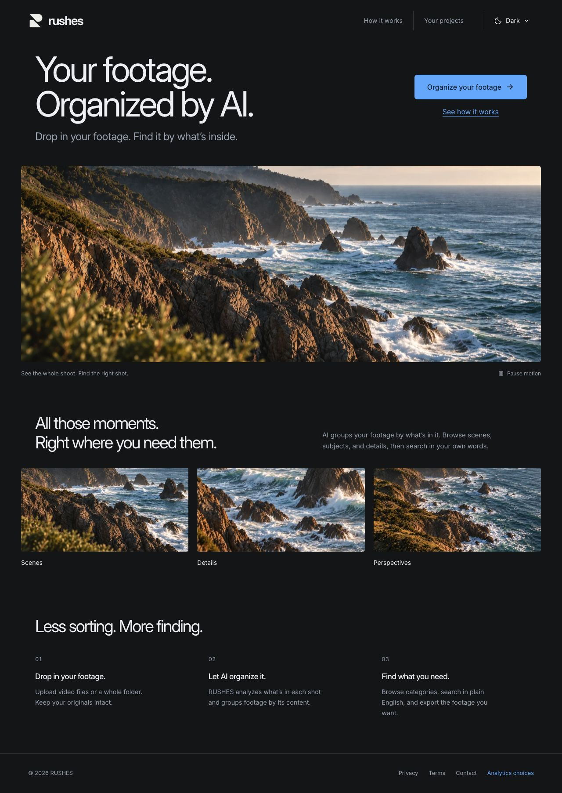

   Mobile: 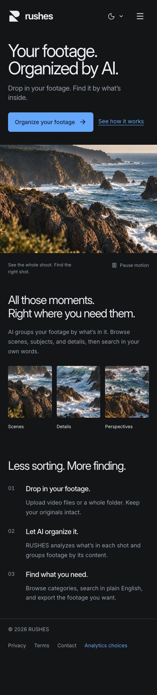

2. **Sign-in — implementation ready, live Google setup pending.** The initial email form was visually healthy but had no Google option. The new code exposes Google only when server configuration is present and gives plain recovery messages for unavailability, cancellation, or an existing password account. The Settings account section is separate from workspace service details. The final browser state below honestly reports unavailability while credential creation awaits confirmation; it is not evidence of working Google consent.

   Before: 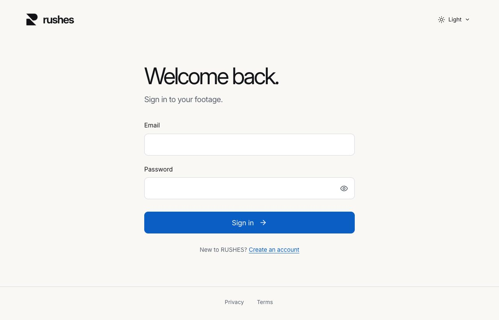

   Current unavailable-provider state: 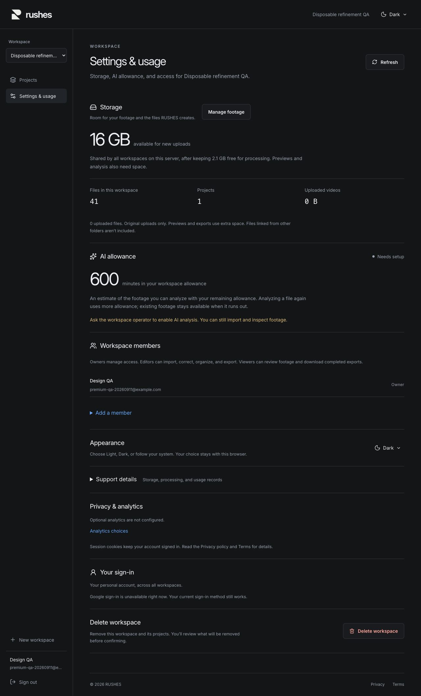

3. **Signed-in navigation — fixed and verified.** Initially, clicking the dashboard logo returned to the public page. The updated public header, onboarding, and product use an authenticated dashboard destination. Browser QA clicked the logo from the public page and from a collection; both opened Projects, with the current workspace retained inside the product.

   Before: 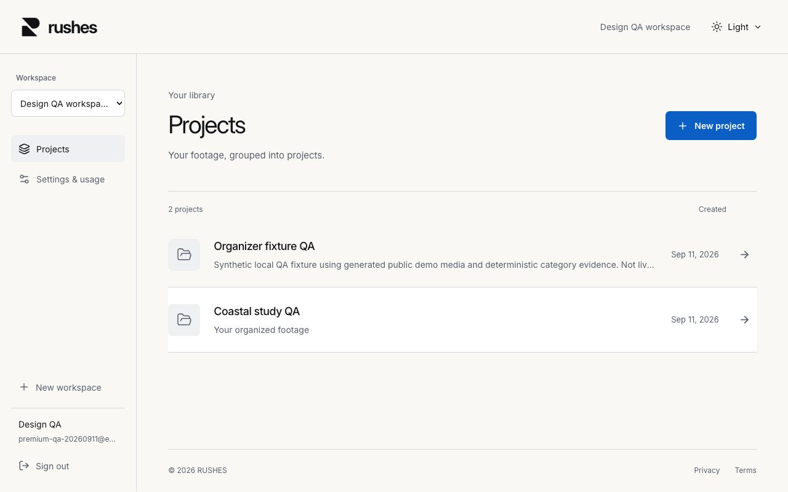

   After clicking the logo: 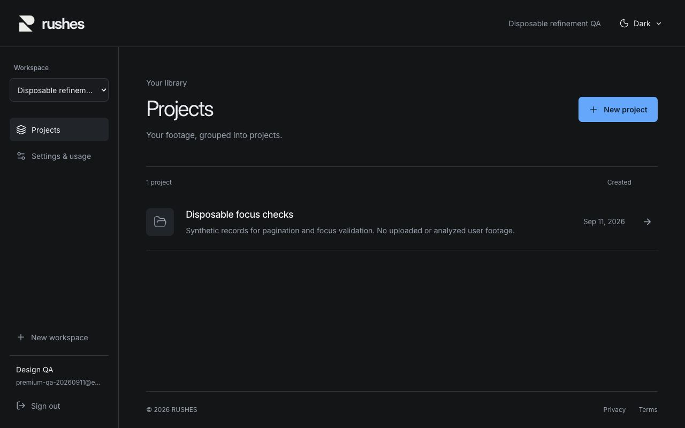

4. **Library loading and retry — fixed and verified.** A disposable 41-record library exercised delayed page 2 and a deliberate category API failure. Rows remained mounted and inactive during pending/error states. The Next button retained keyboard focus after both the delayed request and completion. Retry removed the previous error and activated the returned rows. These intentionally captured pending/error screenshots document those states; their placeholder media is test fixture data, not landing-page content.

   Pending: 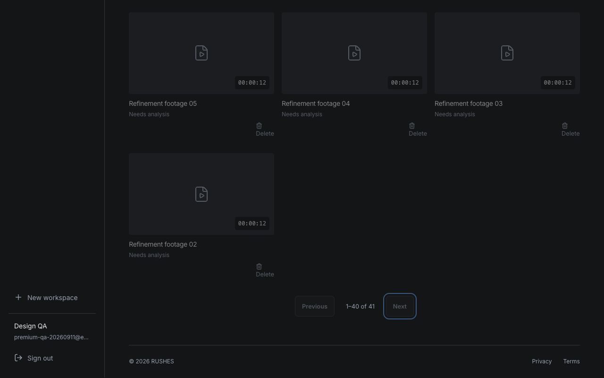

   Failed category: 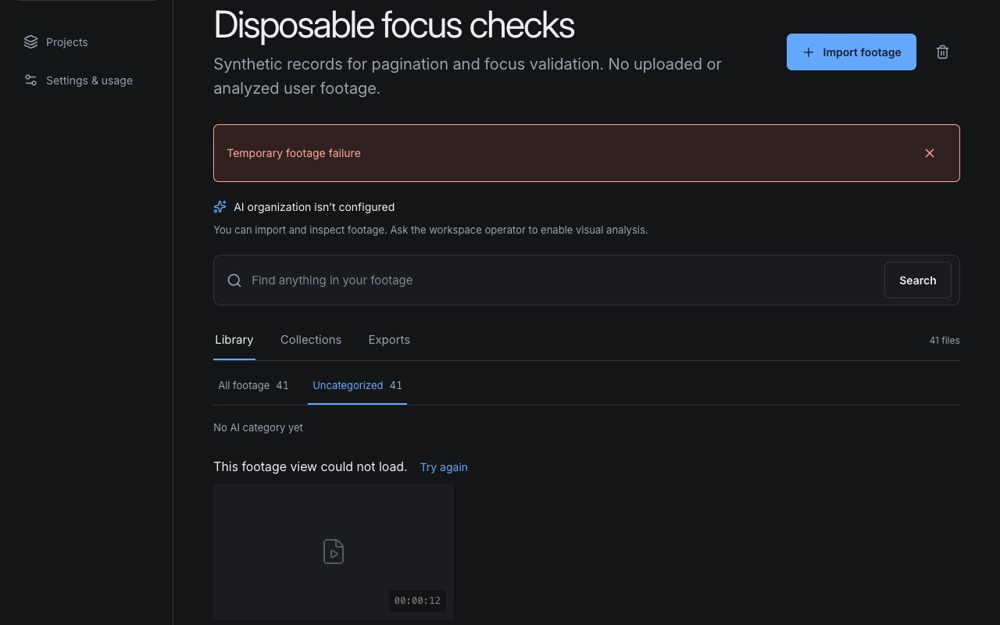

5. **Collection adjustment — fixed and verified.** In a 25-item collection, the final item's editor opened directly after its row and entirely inside the viewport, with focus on the full-source checkbox. Cancel and Save restored focus to that row's Adjust button. A saved note was independently verified through the authenticated API.

   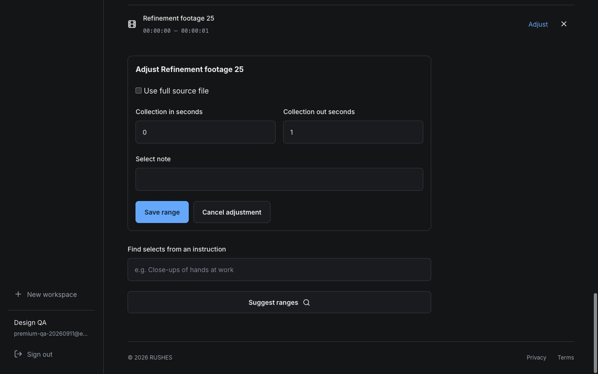

The disposable workspace and all 41 synthetic records/25 collection entries were removed after testing. No user footage or paid analysis was used for these checks.

## Accessibility and evidence limits

Native links, buttons, headings, form labels, focus restoration and inactive stale content were inspected. Screenshots alone do not establish accessibility compliance. No horizontal overflow was observed at 1280 or 390 pixels. Pause held every image transform unchanged while scrolling, and resume/reverse motion worked. A subsequent browser pass verified actual reduced-motion preference switching and restoration, plus repeated landing-page history navigation. Controlled Node checks verified hidden-document scheduling, idle stopping and cleanup; these are simulation evidence, not native background-rendering measurements. Real Google consent, provider Back recovery, and hosted behavior remain unverified pending credential confirmation and any separately authorized deployment.

## Follow-up: reduced motion and browser history

6. **Motion accessibility and history — verified, with a navigation fix.** Enabling the real system preference made every image transform `none` and hid the motion control, including while navigating down to the workflow section. Restoring the original preference brought motion back. A native section anchor exposed a Back-navigation mismatch after Privacy; using the existing Next Link fixed it in two repeated browser round trips. The control also remained usable after returning. Exact observations and controlled lifecycle limits are in [QA](QA.md).

   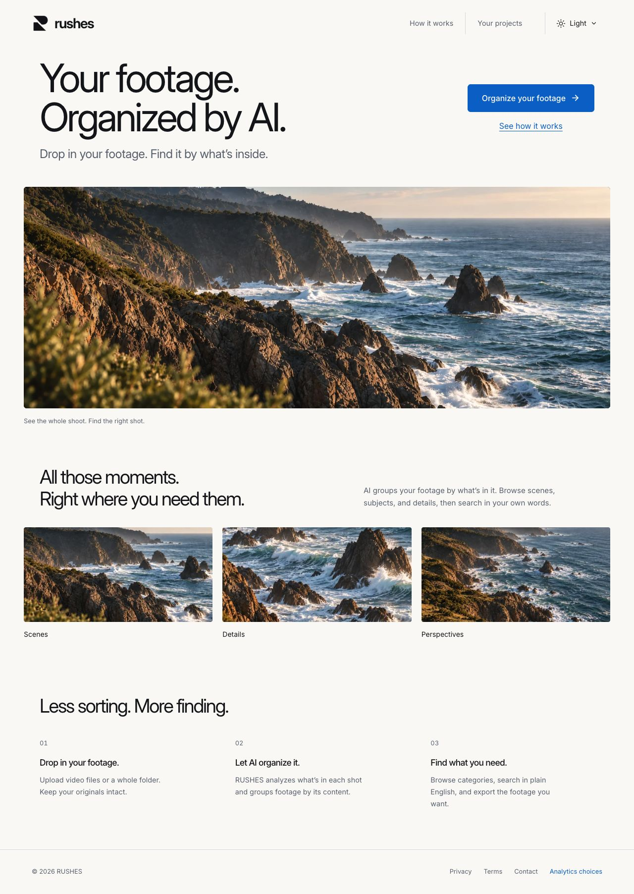
